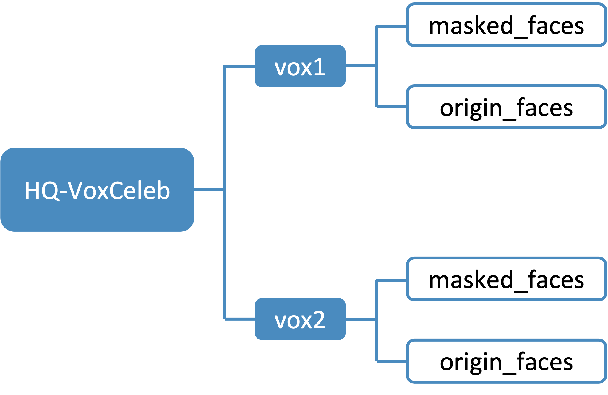

# HQ-VoxCeleb

This repo is the official release of HQ-VoxCeleb dataset, which is proposed in *Speech Fusion to Face: Bridging the Gap Between Human's Vocal Characteristics and Facial Imaging*.

The main paper of this work will be published on ACMMM 2022. Please refer to our [supplementary material](https://sf2f.github.io/#data-quality) for more information about HQ-VoxCeleb dataset.

## Download

HQ-VoxCeleb is now open for download at: [Google Drive Link](https://drive.google.com/file/d/1QSzu45YP_FHIwJAAi9YGzW3nX64RR69S/view?usp=sharing).

## File Structure

The file structure of the above provided `HQ-VoxCeleb` is illustrated in the figure below. Face data of identities from VoxCeleb1 is stored in `vox1/`, and face data of identities from VoxCeleb2 are stored in `vox2/`. Under each partition, face images whose backgrounds are masked by image segmentation algorithm is stored in `masked_faces/`, and the original face images are stored in `origin_faces/`.

## Sampled Dataset

We provide several sampled data in our repo, please refer to [samples](./samples).

